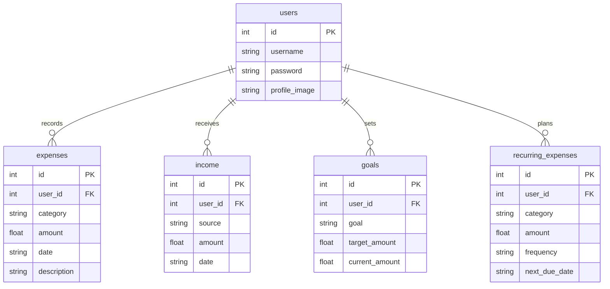

# 🛠️ Developer Documentation - Architecture & Core AI Pipelines

Welcome to the Developer Documentation for the Personal Finance Tracker & AI Analyzer. This document covers the codebase's complete backend architecture, database relationships, data-science pipelines, and API structure.

---

## 🏗️ 1. Architecture & Design Patterns

The codebase is organized using the **Application Factory Pattern** under the `finance_app` package. This separates configuration, route orchestration, model schemas, and calculations into distinct, maintainable modules.

```
Personal-Finance-App-main/
├── app.py                      # Root Web Entry point
├── models.py                   # Compatibility wrapper for models
├── ml_model.py                 # Core AI/ML engines
├── finance_app/                # Main Web App Core Package
│   ├── __init__.py             # Factory loader & bootstrapper
│   ├── config.py               # Settings & environmental parameters
│   ├── extensions.py           # Declares database, hashing, and OAuth
│   ├── helpers.py              # salary leftovers and connection helpers
│   ├── models.py               # SQLAlchemy db schemas & db handlers
│   └── routes/                 # Separated domain route files
│       ├── auth.py             # User onboarding & profile APIs
│       ├── expenses.py         # Transaction record managers
│       ├── goals.py            # Financial target allocators
│       ├── income.py           # Income stream loggers
│       ├── ml.py               # AI dashboards & predictions
│       └── main.py             # Core dashboard renderer & stats
```

### Preventing Circular Imports (`extensions.py`)
In standard Flask apps, referencing the `db` or `bcrypt` objects directly across multiple model and route files can lead to circular dependencies.
- **Solution:** `finance_app/extensions.py` instantiates `db = SQLAlchemy()`, `bcrypt = Bcrypt()`, and `oauth = OAuth()` with no app context.
- The app context is attached later in `finance_app/__init__.py` inside `create_app()` using `.init_app(app)`.
- Models and route controllers safely import directly from `.extensions`.

### Direct Routing Pattern (Zero Blueprint Namespacing)
Standard Flask blueprints automatically namespace all registered routes under the blueprint name (e.g. `@auth_bp.route('/login')` becomes `auth.login` in `url_for()`).
* Since the HTML templates were already hardcoded with global targets (e.g. `url_for('login')`), using traditional blueprints would have broken all navigation.
* **Our Solution:** Instead of mapping routes with native Blueprints, each module inside `finance_app/routes/` exposes a route registration function, e.g.:
  ```python
  def register_auth_routes(app):
      @app.route('/login', methods=['POST'])
      def login():
          ...
  ```
* The application factory calls these functions inside `create_app()`, mounting them globally. This allows clean, decoupled Python files while preserving global endpoint names exactly.

### Package Name Shadowing Prevention
By utilizing a unique package folder name (`finance_app/`) instead of a generic `app/` folder, we prevent Python from shadowing the root launcher script `app.py` when root CLI tools import objects from root (`from app import app`).

---

## 🗄️ 2. Database Schema & Data Models

We use **Flask-SQLAlchemy** (backed by **SQLite**) to map relational tables. The active database is persisted at the root directory: `personal_finance.db`.



### Relational Database Table Specifications
1. **`users` (`User`)**:
   - `id`: Primary key, auto-incrementing integer.
   - `username`: Unique username (used for registration/login credentials verification).
   - `password`: Hashed string (compiled via Bcrypt).
   - `profile_image`: String containing the filename of the uploaded profile photo inside `static/profile_images/`.
2. **`expenses` (`Expense`)**:
   - `user_id`: Foreign key linked to `users.id`.
   - `category`: String (e.g. 'Groceries', 'Utilities', 'Shopping').
   - `amount`: Floating-point amount.
   - `date`: ISO date string (`YYYY-MM-DD`).
   - `description`: Optional text describing the transaction.
3. **`income` (`Income`)**:
   - `user_id`: Foreign key linked to `users.id`.
   - `source`: String (e.g. 'Salary', 'Freelance').
   - `amount`: Income value.
   - `date`: ISO date string (`YYYY-MM-DD`).
4. **`goals` (`Goal`)**:
   - `user_id`: Foreign key linked to `users.id`.
   - `goal`: Financial objective name (e.g., 'Buy a Laptop').
   - `target_amount`: Total funding goal.
   - `current_amount`: Progress amount allocated.
   - *Note:* The system automatically displays the sum of historical monthly cash leftover savings stacked directly on top of the first goal progress.

---

## 🧠 3. Artificial Intelligence & NLP Pipelines (`ml_model.py`)

This section documents the machine learning implementations driving the analytical dashboard.

### A. Next-Month Expense Forecasting (LSTM)
Predicts total monthly expenditure based on personal historical transaction dates and amounts.

1. **Preprocessing & Resampling:**
   - Expenses are loaded into a Pandas DataFrame and resampled to Month-End (`ME`) totals.
   - The resampled values are scaled to a range between `0` and `1` using `MinMaxScaler`.
2. **LSTM Model Structure:**
   - Recurrent Neural Network built with Keras `Sequential` API.
   - **Layer 1:** LSTM layer (50 units) returning sequences.
   - **Layer 2:** LSTM layer (50 units).
   - **Layer 3:** Dense output layer (1 unit) predicting next scaled expenditure.
   - **Optimizer:** Adam.
   - **Loss Function:** Mean Squared Error (MSE).
3. **Monthly Category Forecast Decay Allocation:**
   - To forecast category-specific breakdowns, the system calculates historical monthly category totals.
   - Applies an exponential decay weight favoring recent months to predict category volume:
     $$\text{Predicted Category Volume} = 0.5 \times V_{\text{month}-1} + 0.3 \times V_{\text{month}-2} + 0.2 \times V_{\text{month}-3}$$
   - Category volumes are normalized so their sum exactly fits the global LSTM monthly prediction.

### B. Outlier & Anomaly Spending Detection
Identifies surprise transactions using two alternative models:
1. **Isolation Forest (Statistical Method):**
   - Outliers are detected using tree divisions where anomalous values isolate near root splits.
   - Contamination parameter is set at `0.10` (predicts top 10% outlier months).
2. **Deep Autoencoder Neural Network (Reconstruction Method):**
   - Composed of an Encoder compressing features into a bottleneck representation using a Hyperbolic Tangent (`tanh`) activation, and a Decoder reconstructing them via linear projections.
   - Calculates Reconstruction Mean Squared Error (MSE):
     $$\text{MSE} = \text{Mean}((\text{Scaled Data} - \text{Reconstructed Data})^2)$$
   - Transactions exceeding the **95th percentile** of reconstruction error are flagged as anomalies.

### C. NLP Sentiment & Latent Dirichlet Allocation (LDA) Clustering
Uses advanced text processing and dimensional mappings to cluster transaction context.
1. **Feature Vector Representation:**
   - **Monetary Dimension:** Transaction raw amounts.
   - **NLP Text Dimension:** Term Frequency-Inverse Document Frequency (`TfidfVectorizer`) matrix extracted from transaction descriptions.
   - **Topic Modeling (LDA):** Latent Dirichlet Allocation transforms TF-IDF terms into topic weights across $N$ dimensions (topics).
   - **Sentiment Polarity:** Uses TextBlob to score description polarity between `-1.0` (negative context) and `+1.0` (positive context).
2. **Combined Feature Matrix:**
   - Horizontal stack combining: `[Amount, LDA Topic Projections, Sentiment Scores]`.
3. **Clustering Routines:**
   - **K-Means:** Splits combined feature matrices into $K$ spherical clusters.
   - **Hierarchical (Agglomerative):** Builds cluster trees by grouping features bottom-up.
   - **DBSCAN:** Density-based spatial clustering that automatically handles irregular clusters and separates noise outliers.

---

## 🌐 4. Route & API Directory

Routes register globally via Flask's routing interface.

### User Authentication & Profile
- **`GET /login/google`**: Redirects user to Google OAuth endpoint.
- **`GET /login/google/authorized`**: OAuth callback verifying Google tokens and logging user in.
- **`GET/POST /login`**: Renders login page and verifies password hashes.
- **`GET/POST /register`**: Registers a new user with Bcrypt-encrypted passwords.
- **`GET /logout`**: Clears user session.
- **`POST /verify_password`**: Internal AJAX API verifying password hashes.
- **`GET/POST /profile`**: Manages username, password, and profile image file uploads.

### Relational Transaction Loggers
- **`GET/POST /add_expense`** / **`GET/POST /add_income`**: Creates transaction logs.
- **`GET /view_expenses`** / **`GET /view_income`**: Displays tabular transaction lists.
- **`GET/POST /edit_expense/<id>`** / **`GET/POST /edit_income/<id>`**: Modifies transactions.
- **`GET /delete_expense/<id>`** / **`GET /delete_income/<id>`**: Deletes transaction records.
- **`GET /generate_sample_expenses`**: Action route generating mock random expenses.

### Savings Goals Tracker
- **`GET/POST /add_goal`**: Configures new goals.
- **`GET /view_goals`**: Lists active goal sheets with leftover salary history displays.
- **`GET/POST /edit_goal/<id>`** / **`GET /delete_goal/<id>`**: Modifies / deletes targets.
- **`POST /add_goal_funds/<id>`**: Adds positive decimal amounts to goal sheets.

### Dashboard Core & Data Analytics APIs
- **`GET /`**: Renders main dashboard home.
- **`GET /api/dashboard_data`**: API returns JSON statistics (Expenses by category, total balance, total income) filtered by customizable dates.
- **`GET /predict_expenses`**: Generates next month LSTM models, category breakdown estimations, and Line Graph plots.
- **`GET /view_anomalies`** / **`GET /detect_anomalies`**: Isolation Forest anomaly listings.
- **`GET /detect_anomalies_autoencoder`**: Autoencoder anomaly lists.
- **`GET /expense_clusters`**: TextBlob NLP + K-Means cluster listings.
- **`GET /recommend_savings`**: Recommends savings targets via Nearest Neighbors models.
- **`GET /expenses/clusters`**: Interactive frontend filter to group transactions by category or date.
